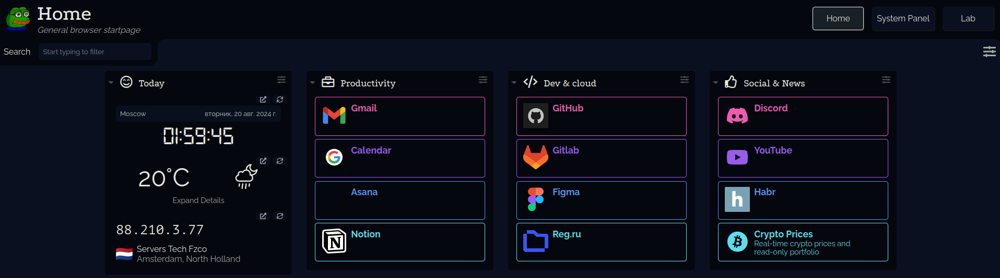
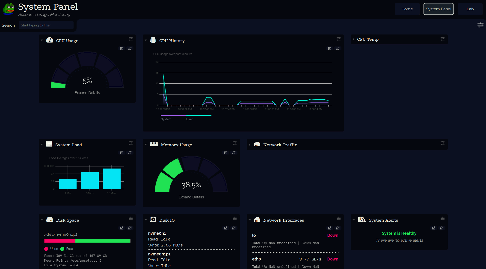
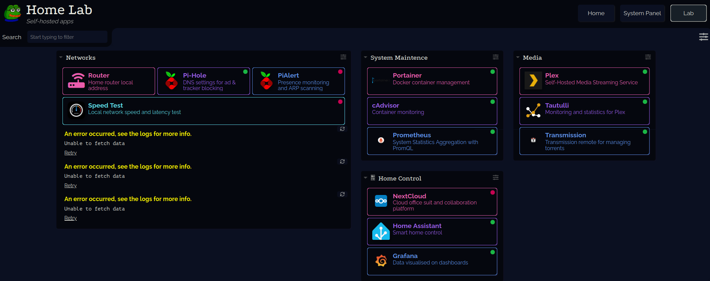

# Dashy System Monitoring with Authorization

This project provides a setup for a system dashboard using Dashy with system monitoring and basic authentication. The setup uses Docker, Nginx, and Glances to display system stats and offer a secure, self-hosted homepage.

## Features

- Dashy: A customizable homepage and dashboard for quick access to your favorite apps, system status, and metrics.
- Glances: Real-time system monitoring integrated with Dashy for CPU, memory, network, and disk usage.
- Nginx: Reverse proxy setup with basic HTTP authentication for added security.
- Docker Compose: Easy deployment and management of all services.

### 1. Home page

A convenient replacement for browser bookmarks with additional information about the time, weather and current IP address



### 2. System Monitoring

The system-panel.yml file includes widgets powered by Glances to monitor various system metrics such as:
- CPU usage and history
- Memory usage
- Network traffic
- Disk space and IO
- System alerts



### 3. Lab

Links to your self-hosted apps with their ping functionality as healthcheck. As an example, widgets for PiHole have been added to the Network group



## Files and Structure
```
dashy
├── config
│   ├── conf.yml: Configuration for the main Dashy dashboard page with multiple sections
│   ├── home-lab.yml: Configuration for the self-hosted apps in your home lab
│   ├── system-panel.yml: Configuration for the system monitoring panel,
│   └── icons: Icons for pages
├── nginx
│   ├── .htpasswd: File storing credentials for basic authentication.
│   └── nginx.conf: Nginx configuration for reverse proxying with HTTP basic authentication.
├── Template.Net.Microservice.DDD.Infrastructure
│   ├── Services
│   └── ...other
└── docker-compose.yml: Docker Compose configuration for setting up and running Dashy, Glances, and Nginx.
```

## Setup and Installation
### Step 1: Clone the Repository


```bash
git clone <repo-url>
cd <dashy-directory>
```

### Step 2: Configure the Dashboard

1. conf.yml: Customize your main dashboard by modifying links, widgets, and sections. Change the api keys and culture info
2. home-lab.yml: Set up links and widgets for your self-hosted services.
3. system-panel.yml: Customize system monitoring widgets.

### Step 3: Configure Authentication

Update the .htpasswd file with your credentials or generate a new one:
```bash
htpasswd -c ./nginx/.htpasswd <username>
```

Test user/password
```user 123```

If you are already using Nginx, you can remove the Nginx service from docker-compose.yml and integrate the configuration into your existing setup

### Step 4: Start the Services

Run the following command to start all services:
```bash
docker-compose up -d
```
This will start:
- Dashy on port 9040 (reverse-proxied by Nginx)
- Glances for system monitoring
 -Nginx for reverse proxy and authentication

### Step 5: Access the Dashboard
Open your browser and navigate to http://<your-server-ip>:9040. You will be prompted to log in using the credentials from .htpasswd.

